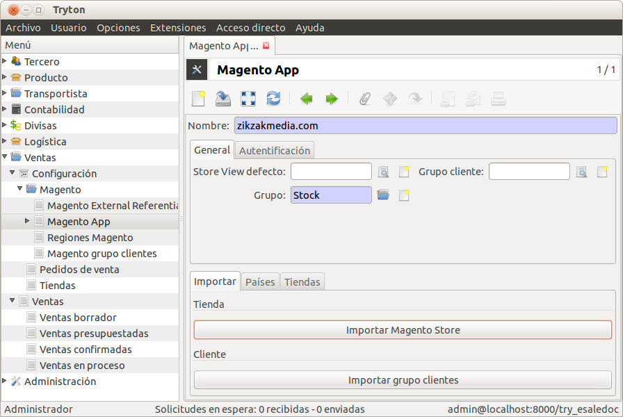
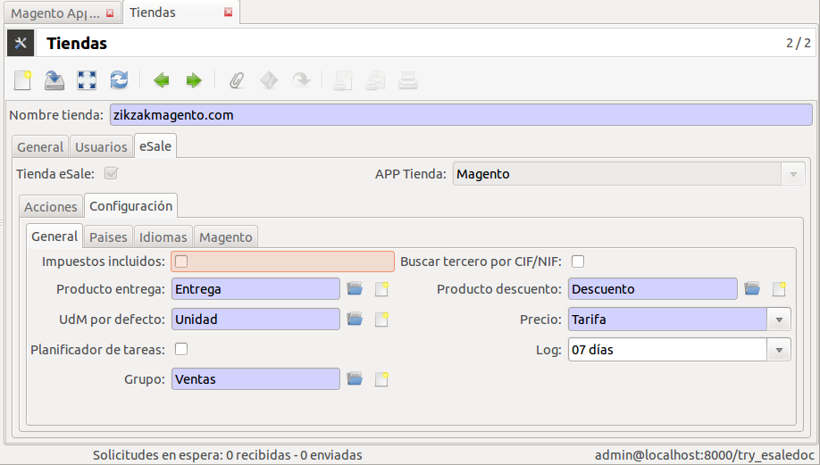
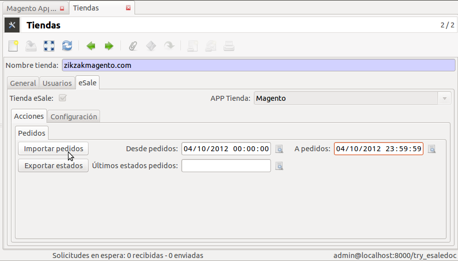

=======
Magento
=======

A diferencia del módulo `Magento Connect
<http://openerp.zikzakmedia.com/Esale/MagentoConnect>`_ de OpenERP, este módulo
se ha simplificado y dividido en dos: **pedidos de venta** y **productos**.
De esta forma, puede instalar el módulo de Magento para ventas sin necesidad de
gestionar los productos de Magento con el ERP.

Configuración del servidor Magento
==================================

La configuración inicial es técnica y se efectuará en el momento de dar de alta
un servidor Magento en el ERP. Para configurar el servidor de Magento acceda a
|menu_magento_app|.

.. |menu_magento_app| tryref:: magento.menu_magento_app_form/complete_name

* Nombre

  * Nombre informativo del servidor de Magento
  
* General

  * Store View por defecto (disponible después de importar Magento Store)
  * Grupo de clientes por defecto (disponible después de importar grupo de
    clientes)
    
* Autenticación

  * URI del servidor Magento (con / al final).
  * Usuario webservices de Magento.
  * Password webservices de Magento.
  
* Importar

  * Importar Magento Store: Importa toda la estructura de las tiendas de
    Magento (website/store/view) y genera una tienda Magento en |menu_sale_shop|.
  * Importar grupo de clientes: Importa todos los grupos de clientes de Magento.
  
* Países

  * Países: Países que queremos importar regiones de Magento para los pedidos
    de venta.
  * Regiones: Asocia las regiones de Magento con las subdivisiones de Tryton.
  
* Tiendas

  * Información de nuestro Magento APP con la estructura de website/store/view

.. note:: Recuerde que deberá instalar el módulo que amplia los webservices de
          Magento. Dispone del botón **Test conexión** para testear si los
          datos introducidos son correctos.

Configuración de la tienda
==========================

A |menu_sale_shop| configure los valores de la tienda Magento. Fíjese que en
las tiendas Magento, el campo **APP tienda** marcará que es una tienda Magento
(no es una tienda Tryton eSale por defecto).

En la configuración de la tienda esale, dispone de una pestaña más referente a
la configuración de la tienda Magento.

* **Referencia Magento:** Usar el número de pedido de Magento
* **Precio global:** Para los multiestores, si se usa precio global o no (sólo
  para actualizaciones de precio)
* **Estados importación:** A partir del estado del pedido a Magento, podemos
  activar el pedido a Tryton si se confirma o se cancela.
* **Exportar estados:** Según el estado de Tryton, marcar el estado a Magento
  y/o notificar al cliente.
* **Métodos de pago:** Relaciona los pagos de Magento con los pagos de Tryton

Pedidos
=======

La importación de pedidos de Magento a Tryton se puede hacer de dos formas:

* **Importación manual**: A |menu_sale_shop| dispone del botón **Importar
  pedidos**.
* **Importación automática**: En la configuración de la tienda active el
  campo **Planificador de tareas**. Importa los pedidos según el intervalo de
  ejecución del cron (cada 30 minutos, 20 minutos,...)

Importar pedidos
================

En el menú |menu_sale_shop| dispone del botón **Importar pedidos**. La
importación de pedidos se realiza según intervalo de fechas. En este ejemplo,
se importarán todos los pedidos del día 4 de octubre, desde primera hora de la
mañana hasta el final de la noche. Si no especifica fecha final, el sistema usa
la fecha actual (fecha de creación del pedido a Magento).

Exportar estado
===============

En el menú |menu_sale_shop| dispone del botón de **Exportar estados** el cual
sincroniza los estados de Magento con los del ERP (complete, canceled,
processing,...) de los pedidos a partir de la fecha especificada (fecha de
modificación del pedido).

.. note:: Si no gestiona los productos con el módulo 
          `Productos Magento <../magento_product/index.html>`_, recuerde que
          también deberá añadir al ERP aquellos productos que quiera que su
          estoc se gestione con Tryton. En el momento de recibir los pedidos,
          el sistema buscará productos por código en el ERP para relacionarlos
          en el pedido de venta.

.. |menu_sale_shop| tryref:: sale_shop.menu_sale_shop/complete_name

Módulos de los que depende
==========================

Instalados
----------

.. toctree::
   :maxdepth: 1

   /esale/index

Dependencias
------------

* `Comercio electrónico`_

.. _Comercio electrónico: ../esale/index.html
